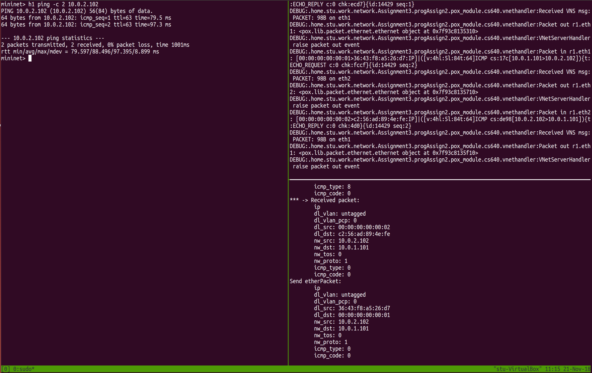

# Mininet Assignment 2: Link & Network Layer Forwarding

## Setup Environment
1. Install required packages
    ```bash
    sudo apt-get update
    sudo apt-get install -y python-dev python-setuptools flex bison ant openjdk-7-jdk git tmux
    ```
2. Install ltprotocol
    ```bash
    cd ~
    git clone git://github.com/dound/ltprotocol.git
    cd ltprotocol
    sudo python setup.py install
    ```
3. Checkout the appropriate version of POX
    ```bash
    cd ~
    git clone https://github.com/noxrepo/pox
    cd ~/pox
    git checkout f95dd1
    ```
4. Get the starter codes, replace the src folder with the one in the submit files and  
    ```
    cd ~/progAssign2
    ```
5. Symlink POX and configure the POX modules
    ```bash
    cd ~/progAssign2
    ln -s ../pox
    ./config.sh
    ```

6. Compile the java code and pack it with jar by running
    ```bash
    ant
    ```

## Test the codes
### Step 2: Virtual Switch
In the `handlePacket(...)` method I implemented the forwarding table and the action of a switch for forwarding. To test the `handlePacket(...)` method in the `cs.sdn.vnet.sw.Switch`, please follow the steps below:
1. Start mininet:
   ```bash
    cd ~/progAssign2/
    sudo python ./run_mininet.py topos/single_sw.topo
   ```
2. Open another terminal and start the controller:
   ```bash
   cd ~/progAssign2/
   ./run_pox.sh
   ```

3. Start the java code:
    ```bash
     java -jar VirtualNetwork.jar -v s1
    ```

4. Go back to the terminal where Mininet is running:
   ```bash
   mininet> h1 ping -c 2 10.0.1.102
   ```
5. Now you will see the something like the figure below, which means the java code successfully simulate the action of a switch.
   

### Step 3: Virtual Router
I completed the `lookup(...)` function in the `cs.sdn.vnet.rt.RouteTable` class and implemented the action of a router to check and forward packets. To test the methods, please follow the steps below:
1. Start mininet:
   ```bash
    cd ~/progAssign2/
    sudo python ./run_mininet.py topos/single_rt.topo -a
   ```
2. Open another terminal and start the controller:
   ```bash
   cd ~/progAssign2/
   ./run_pox.sh
   ```

3. Start the java code:
    ```bash
     java -jar VirtualNetwork.jar -v r1 -r rtable.r1 -a arp_cache
    ```

4. Go back to the terminal where Mininet is running:
   ```bash
   mininet> h1 ping -c 2 10.0.2.102
   ```
5. Now you will see the something like the figure below, which means the java code successfully simulate the action of a router.
    

Though there are some bugs of pox which will show a lot of errors, the code can also handle the routers and switches in topos, including pair_rt.topo, triangle_rt.topo, single_each.topo and triangle_with_sw.topo.
